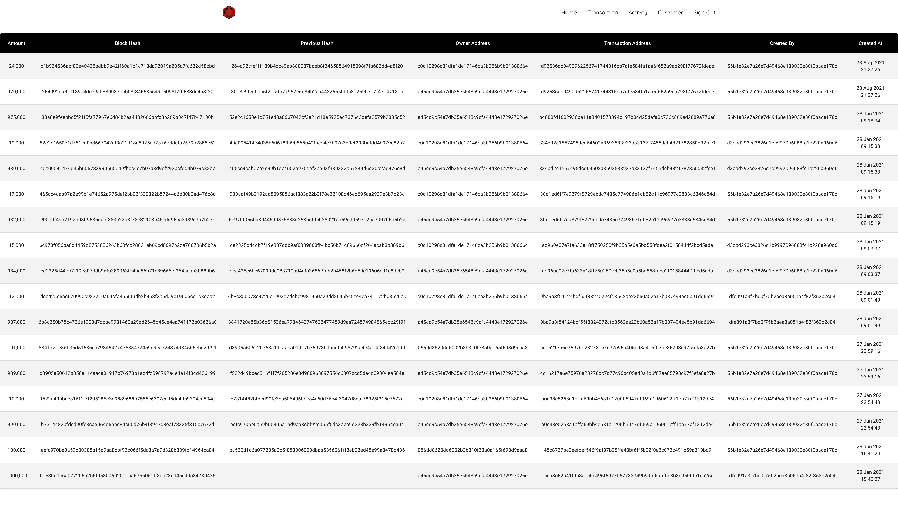
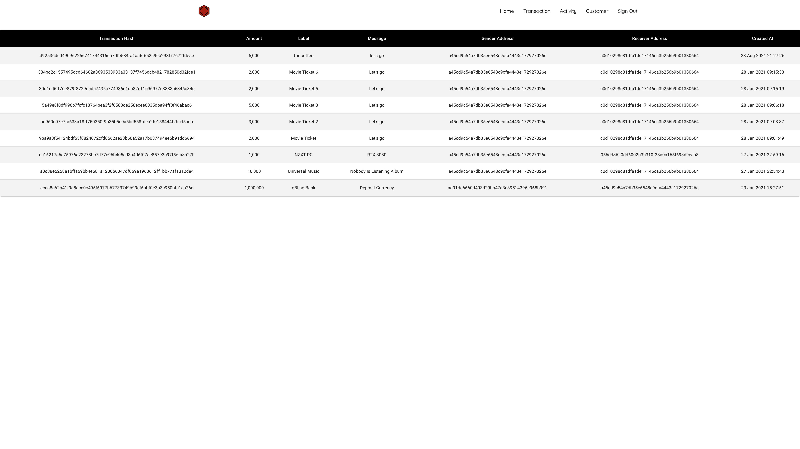
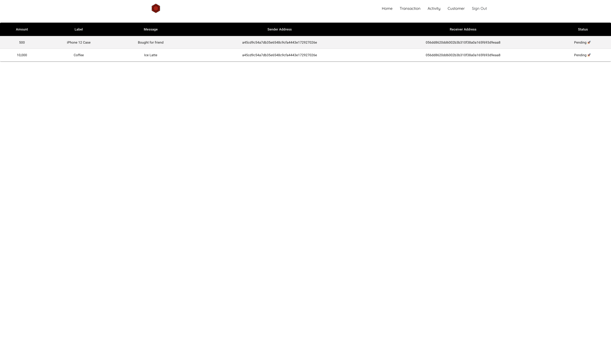
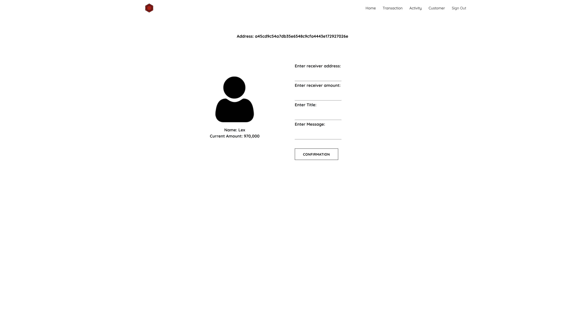

# dBlind - Blockchain Simulation

### [Slide Deck | PDF](https://github.com/lexiddie/dblind-blockchain/blob/main/Blockchain%20Simulation.pdf)

### [YouTube Link | Demonstration](https://youtu.be/hb8OWsP9qhs)

 

The blockchain simulation provides concepts in blockchain technology using the consensus algorithm Proof of Elapsed Time to validate transactions in the simulation.

## Background

dBlind Simulation is a private blockchain application with the consensus algorithm PoET to simulate the banking sector.

The simulation will be based on the financial sector because blockchain technology has many potentials for financial industries. Moreover, it can eliminate the threat or the risk of fraud in all areas of banking.

For instance, most fraud cases are double-spending, or data can be tampered with or stolen to alter a particular situation or customers’ data explosion into public.

## Blockchain

The blockchain is a digitally decentralized ledger, as we so-called data. Its primary technology provides a decentralized network without the trusted third party, secured using cryptography, and regulated under the consensus algorithm.

Blockchain is an immutable and irreversible chain. Moreover, most blockchains are distributed to their chains of the network, which fully peers to peers. Again, those networks are computers that do the computational equation as they are called nodes.

Blockchain provides an independent, tamperproof, transparent new platform to store, transmit securely, and process sensitive and valuable data.

Blockchain is only consisting of a list of validated blocks. Moreover, each block is connecting to its predecessor to the genesis block.

## Private Blockchain | Permissioned Blockchain

Private Blockchain is an innovation-only single organization network to have access and authority over the network. It is a partially decentralized system.

## Technology Stack and Tools

- React
- Next.js
- Redux
- JavaScript
- TypeScript
- Google Cloud Platform
- Firebase
- Sass
- Bootstrap
- CryptoJS
- Node.js
- AWS EC2

## Platform

- **dBlind App**: is written in TypeScript using ReactJS for Client-Side Application.
- **dBlind Cloud**: is written in TypeScript using NodeJS 12 as the Cloud Functions to be a middleware or a network protocol to prevent deleting, editing or invaliding transactions into the database. Additionally, it is the one who fetches transactions from pools and generates random times into each node to add blocks.
- **dBlind Service (Node)**: is written in TypeScript using NextJS as a web service to facilitate as a node to participate in the private blockchain simulation.

## Processes

1. Customers can make a payment to another customer. Then all transactions will be added into the network pools. 🚀
2. **Cloud Functions**, also known as the **network protocol**, will get the earliest transaction within the pool and generate the transaction into the queue. Then, it takes all nodes within the network to continue the work by giving them generated random times. 😈
3. Web Service facilitated as the node will listen in real-time and pick the very first queue as its task. The very node with the smallest amount of time will complete the adding blocks and distribute them across the network. ✌🏿
4. When a node has completed its task, it marks that specific queue as **isCompleted**, then other nodes while countdown for its task will halt everything and prepare to receive the next task within the network by listening to the next queue. 🤖
5. During the **distribution**, each node will check the received transactions themselves and only receive the **validated transactions** into their nodes. 🥶
6. If any node has missing blocks of transactions, it will **reinstate** itself by pulling the missing blocks of the transaction from the network. Moreover, **verify those blocks** by checking the block’s hash value. 😈
7. Since this is a private blockchain simulation, the database is **centralized** and **decentralized** storage. Cloud Functions will handle all the procedures like preventing data tampered with and data deletion. Suppose any block or transaction information is being deleted. In that case, the Cloud Functions will reinstate the data back, or if the data is being modified, it will reinstate the previous one that matches the hash value of a block. 😵‍💫
8. And each node that stores data as distribution will not take the modified block or transaction into itself. Moreover, it will delete invalid blocks automatically. 👊🏿

## The Main Attributes of Blockchain

- **Partial peer-to-peer**: centralized & decentralized storage and all nodes will receive blocks of transactions from each other and pull from centralized data to check.

- **Distributed**: when a node has a permissioned right to add a block into the network, it will get all nodes and distribute to them concurrently.

- **Cryptographically secured**: all data models are using hash value and hash value reference addresses.

- **Add-only**: cannot be tampered or deleted when hard manually deletion.

- **Consensus**: this simulation is using Proof of Elapsed Time.

## Members and Roles

SOKVATHARA LIN: Full-Stack Developer

## Licenses

Content is released under the consent of the member who developed this very system. Any individual is allowed to use our project freely due to we have open-sourced this project.

## Screenshot

